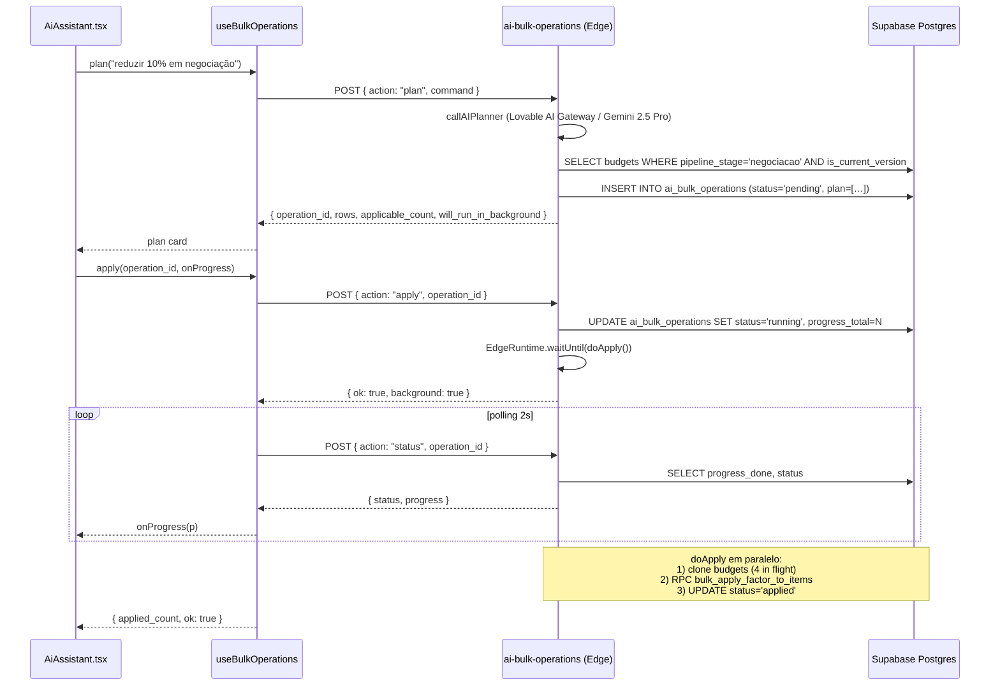

# Operações em massa pelo Assistente de IA

## O que mudou (suporte a 200+ orçamentos)

A função `ai-bulk-operations` agora suporta com segurança operações que afetam até **1.000 orçamentos** em uma única chamada, com:

1. **Filtros estruturados** que o LLM extrai do comando em linguagem natural:
   - `pipeline_stages` (lead, briefing, visita, proposta, **negociacao**)
   - `internal_statuses` (novo, em_analise, waiting_info, em_revisao, revision_requested, delivered_to_sales, published, minuta_solicitada)
   - `created_from` / `created_to` (já existiam)
   - Status protegidos (`contrato_fechado`, `perdido`, `lost`, `archived`) são **sempre excluídos**, mesmo que o LLM os mencione.
2. **Modo background automático** quando a operação afeta mais de **50 orçamentos** — a Edge Function devolve imediatamente o `operation_id` e prossegue executando via `EdgeRuntime.waitUntil`. O cliente faz **polling** em `action: "status"` para acompanhar progresso.
3. **RPC SQL `bulk_apply_factor_to_items`** aplica o fator percentual em uma única transação no Postgres — substitui dezenas/centenas de updates row-a-row do código antigo. Para 250 orçamentos com ~60 itens cada, vai de minutos para milissegundos na fase de update.
4. **Heartbeat & progresso persistidos** em `ai_bulk_operations.progress_done / progress_total / progress_phase / heartbeat_at`.
5. **Limite duro** continua existindo: `MAX_AFFECTED = 1000`. Acima disso o `plan` retorna 400 com instrução para refinar.

## Exemplos de comandos

| Comando | Resultado |
|---|---|
| "reduzir 10% do valor total de todos os orçamentos em negociação" | LLM gera `action_type='financial_adjustment'`, `filters={pipeline_stages:['negociacao']}`, `params={mode:'percent',value:10,direction:'decrease'}`. Backend filtra todos os orçamentos com `pipeline_stage='negociacao'` e versão atual, clona cada um, aplica fator 0.9 nos itens via RPC SQL. |
| "estender validade para 60 dias em todos os orçamentos aguardando informação" | `action_type='validity_change'`, `filters={internal_statuses:['waiting_info']}`, `params={validity_days:60}`. |
| "reduzir 5% em propostas criadas este mês" | `pipeline_stages=['proposta']`, `created_from=YYYY-MM-01`, `created_to=hoje`. |

## Fluxo plan → apply → status → revert

## Reverter

`action: "revert"` continua funcionando — em `financial_adjustment` deleta as versões clonadas (com guards para versões publicadas / movidas após o apply) e restaura a versão antiga como `is_current_version`.

## RLS e segurança

- Tabela `ai_bulk_operations` tem RLS apenas para `admin`.
- A RPC `bulk_apply_factor_to_items` é `SECURITY DEFINER` mas verifica `has_role(auth.uid(), 'admin')` antes de aplicar.
- A Edge Function valida o JWT, exige `admin` role e bloqueia status protegidos em duas camadas (na query e no executor).

## Limites operacionais

| Recurso | Limite | Onde mudar |
|---|---|---|
| Máximo de orçamentos por operação | 1.000 | `MAX_AFFECTED` em `index.ts` |
| Threshold para background | 50 | `BACKGROUND_THRESHOLD` em `index.ts` |
| Timeout máx do polling no front | 15 min | `useBulkOperations.ts` → `maxWaitMs` |
| Intervalo de polling | 2s (configurável pelo backend) | `poll_interval_ms` na resposta |
| Concorrência de clones | 4 paralelos | `runInChunks(ids, 4, …)` |
| Fator percentual permitido | 0 < value ≤ 90 | validação no PLAN |
| Faixa do fator na RPC | 0 < factor ≤ 10 | guarda em `bulk_apply_factor_to_items` |
